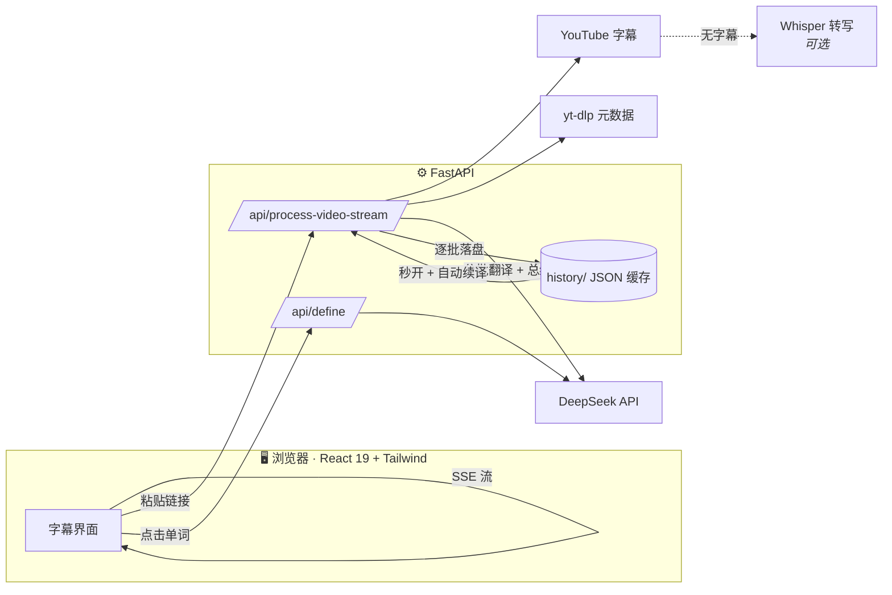

# 系统架构

一句话：**浏览器里的 React 应用** ↔ **FastAPI 后端** ↔ **DeepSeek / YouTube / 本地缓存**。

---

## 总览



| 层 | 技术 | 职责 |
|---|---|---|
| 前端 | React 19、Vite、Tailwind、Framer Motion | 界面、播放同步、字幕渲染、流式接收 |
| 后端 | Python、FastAPI | 抓字幕、调 AI、分批翻译、缓存、SSE 推送 |
| AI | DeepSeek V4 Flash / Pro（默认 Flash） | 翻译、生词高亮、视频总结、词典释义 |
| 兜底 | faster-whisper（可选） | 无字幕视频的本地语音转写 |

## 核心数据流：流式管线

这是整个产品的心脏，详见 [规格 001](../specs/001-streaming-pipeline/spec.md)：

1. 用户粘贴链接 → 后端用 `youtube-transcript-api` 抓英文字幕（秒级）。
2. 字幕按句切分（`group_transcript_blocks`），**英文立即通过 SSE `meta` 事件推给前端**，用户马上能看能播。
3. 后端按每批 20 句调 DeepSeek 翻译，**每翻完一批就推一个 `batch` 事件并落盘**。
4. 全部翻完后生成中文总结（`summary` 事件），最后 `done`。
5. 任何时候中断都没关系：已翻的部分已存盘，未翻的标记为 `[未翻译]`，下次打开自动续译（`retranslate_marked_blocks`）。

## 目录结构

```
yt-bilingual-app/
├── AGENTS.md          AI 开发者入口：读文档的顺序、硬性规则
├── CONSTITUTION.md    项目宪法：产品与工程最高原则
├── frontend/          React + Vite 前端
│   └── src/
│       ├── App.tsx            顶层：状态、播放控制、快捷键、视图切换
│       ├── components/        UI 组件（见该目录 README）
│       └── lib/               纯逻辑：api / transcript / settings / progress / exporter / tts / toast / sentences
├── backend/           FastAPI 后端（模块分工见 backend/README.md）
├── mobile/            Expo React Native 客户端（对接经典版 API）
├── scripts/           媒体录制（capture.mjs）+ 字幕下载工具
├── subtitles/         本地剧集 SRT（不入库，见 .gitignore）
├── content/sentences/ 句子精背静态内容（5 级 × 100 句，入库）
├── history/           运行时缓存（不入库）：每视频一个 JSON + 收藏/订阅/词典缓存
├── docs/              本套中文文档
├── specs/             各功能的规格与方案
└── .specify/          规格/方案/任务模板
```

## 后端模块分工

| 模块 | 职责 | 关键内容 |
|---|---|---|
| `main.py` | 应用装配（入口 `uvicorn main:app` 不变） | CORS、`require_api_key` 中间件、挂载路由、`/health` |
| `config.py` | 环境与配置 | 数据目录、安全开关、`MODEL_CATALOG`、`VOCAB_LEVELS` |
| `llm.py` | DeepSeek 客户端 | OpenAI 兼容协议、文本输出、JSON 输出 |
| `transcripts.py` | 字幕获取与切句 | `fetch_english_transcript`（失败→清晰中文错误）、`group_transcript_blocks`、`parse_srt`、Whisper 转写兜底 |
| `translate.py` | AI 翻译核心 | `process_llm_batch`（**按 id 对齐**防错位、按水平挑生词）、`retranslate_marked_blocks`（自愈）、`_stream_translate`（逐批落盘+推送）、总结 |
| `routes_videos.py` | 视频路由 | 估价（含预取缓存）、经典/流式处理、历史（含路径穿越防护）、频道更新（线程池+15min 缓存） |
| `routes_content.py` | 内容路由 | 本地剧集（SRT）、句子精背（读 `content/sentences/`） |
| `routes_user.py` | 用户路由 | 词典（`dictionary_cache.json` 每词一次）、收藏、订阅、复习状态 |

## 前端模块

- **`lib/`（纯逻辑，无 UI）**：`api.ts`（带 Key 的 fetch）、`transcript.ts`（活跃句计算、SSE 解析、译文显示模式）、`settings.ts`（生词水平）、`progress.ts`（进度记忆）、`exporter.ts`（Anki/CSV 导出）、`tts.ts`（朗读）、`toast.ts`（轻提示）。
- **`components/`**：全部 UI 组件的逐文件说明见 [components/README](../frontend/src/components/README.md)（单一清单，避免两处漂移）。

## 数据存储

全部是本机 JSON 文件（`history/` 目录，不入库）：

- `<频道>_<日期>_<videoId>.json` — 每个视频一份：元数据 + 双语字幕 + 总结。
- `<剧名>_S01E01.json` — 每集本地剧集一份。
- `favorites.json` — 收藏（句子 + 生词）。
- `review_state.json` — 收藏复习调度状态，不改变收藏导出格式。
- `subscriptions.json` — 订阅频道。
- `dictionary_cache.json` — 词典释义缓存。

## 部署

本项目以本机自用为主，不带部署配置（历史上的 Dockerfile 等已随重构移除，需要时可从 git 历史找回）。若要公网部署，务必设置 `API_AUTH_KEY` 和 `CORS_ORIGINS`（见 [开发指南](./开发指南.md)）。
